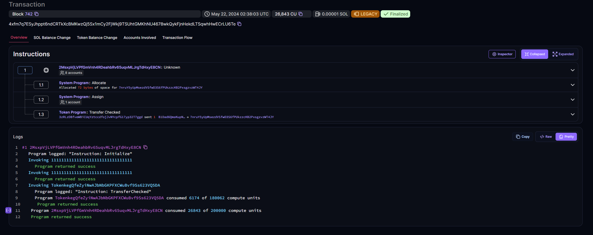
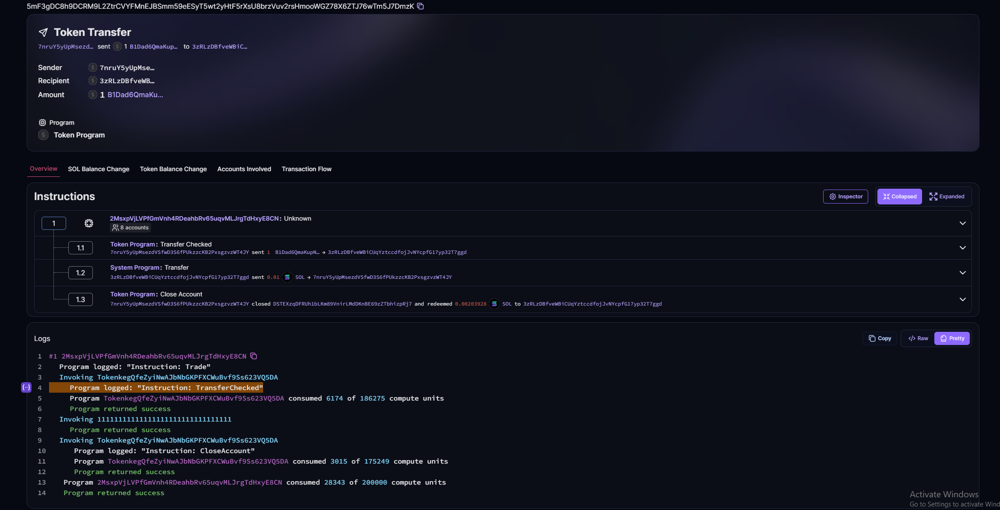

# Solana Program functions
## Initialize function 
initializes relevant token accounts
and sends a user's nft to the loss harvester account in exchange for an arbitrary amount of SOL (to register as a tax event).

## Trade function

Trades the nft back to the user for an amount of SOL, completing the harvest.